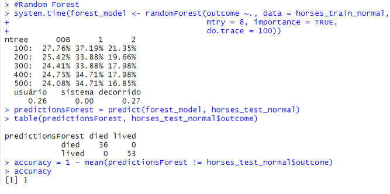

# DATA MINING PROJECT

This project consists on working with data of horses' health and learn which attributes can determine if a horse lives or dies.

All the project is written in Portuguese.

The whole project was done in R language.

I begin the project discovering more about the data I have using exploratory data analysis, searching missing values, outliers and unnecessary attributes.

After, I use Chi-square and Principal Component Analysis (PCA) to rank the attributes and find which of them are unnecessary.

Finally, I test some Machine Learning models on my clean data: Decision Tree, Support Vector Machine (SVM), Random Forest and K-nearest Neighbors (KNN).

In the end, I compare all the models I have and choose the best one based on the biggest accuracy to predict the horse's health.

  

